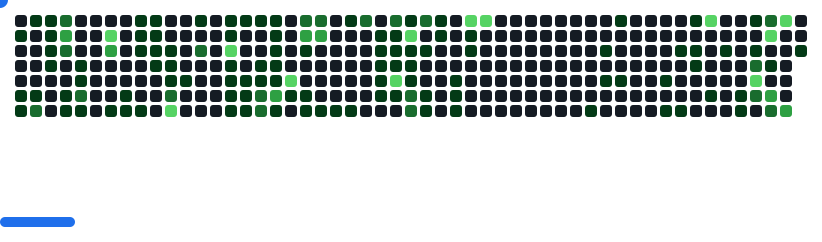

# 👋 Hi, I’m ALVI A V

I make computers do interesting shit.

[Portfolio](https://alviav.vercel.app)

## 🛠️ Languages & Tools

<table>
  <tr>
    <td valign="top"><strong>Languages</strong> 
      
      
      
    </td>
    <td valign="top"><strong>Frameworks</strong> 
      
      
      
    </td>
  </tr>
  <tr>
    <td valign="top"><strong>Databases</strong> 
      
      
      
      
    </td>
    <td valign="top"><strong>Tools</strong> 
      
      
      
      
    </td>
  </tr>
</table>

<picture>
  <source media="(prefers-color-scheme: dark)" srcset="images/breakout-dark.svg" />
  <source media="(prefers-color-scheme: light)" srcset="images/breakout-light.svg" />
  
</picture>

## 🔗 Let’s Connect

- Portfolio: [alviav.vercel.app](https://alviav.vercel.app)
- Email: [alvivinod16@gmail.com](mailto:alvivinod16@gmail.com)
- LinkedIn: [Alvi A V](https://linkedin.com/in/alvi-av)
- Devfolio: [a56](https://devfolio.co/@a56)
- LeetCode: [A56A5](https://leetcode.com/u/A56A5/)

 

---

Check out my latest projects below !!

